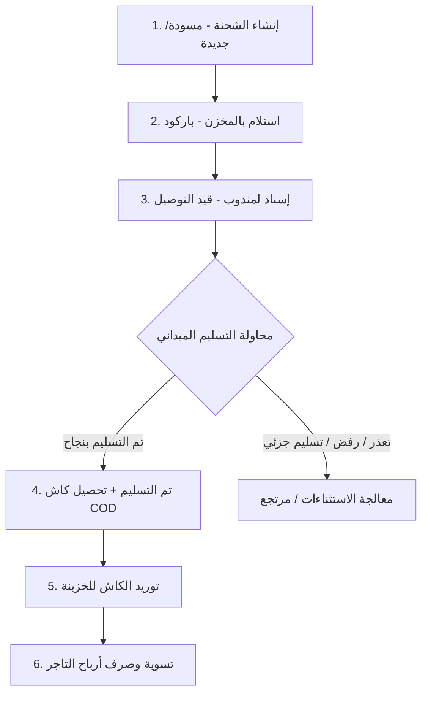

# 📖 الدليل التشغيلي والمحاسبي المتكامل لمنظومة Deliver It

دليل تفصيلي شامل يشرح كل شاشة، الحقول والخيارات، ودورات العمل الميدانية والمالية بالتفصيل لمديري العمليات، المحاسبين، ومسؤولي الفروع.

---

# 📑 الفهرس العام
1. [الهيكل المعماري وأدوار المستخدمين والصلاحيات](#1-الهيكل-المعماري-وأدوار-المستخدمين)
2. [دورة حياة الشحنة الميدانية (من الإنشاء للتسليم النهائي)](#2-دورة-حياة-الشحنة-الميدانية)
3. [الشرح التفصيلي لتبويبات قسم التشغيل (Operations)](#3-شرح-تبويبات-قسم-التشغيل)
   - [3.1 الرئيسية (Overview)](#31-الرئيسية-overview)
   - [3.2 مركز العمليات وإسناد الدفعات (Operations Center)](#32-مركز-العمليات-operations-center)
   - [3.3 مركز المتابعة والاستثناءات (Exceptions)](#33-مركز-المتابعة-والاستثناءات-exceptions)
   - [3.4 الاستلام بالباركود (Barcode Intake)](#34-الاستلام-بالباركود-barcode-intake)
   - [3.5 إدارة وبوالص الشحنات (Shipments)](#35-إدارة-وبوالص-الشحنات-shipments)
   - [3.6 الشات والمحادثات الميدانية (Chat)](#36-الشات-والمحادثات-chat)
4. [الشرح التفصيلي لقسم التحليل والماليات (Finance)](#4-شرح-قسم-التحليل-والماليات)
   - [4.1 التقارير ومؤشرات الأداء (Reports)](#41-التقارير-reports)
   - [4.2 المحاسبة وعهد المناديب (Accounting)](#42-المحاسبة-وعهد-المناديب-accounting)
   - [4.3 التسويات وصرف أرباح التجار (Settlements)](#43-التسويات-settlements)
5. [الشرح التفصيلي لقسم الإدارة والسياسات (Management)](#5-شرح-قسم-الإدارة-والسياسات)
   - [5.1 إدارة المناديب والأسطول (Drivers)](#51-إدارة-المناديب-drivers)
   - [5.2 إدارة التجار وعقود الأسعار (Merchants)](#52-إدارة-التجار-merchants)
   - [5.3 إعدادات وسياسات الشركة (Settings)](#53-إعدادات-وسياسات-الشركة-settings)
6. [المعادلات والقواعد المحاسبية الدقيقة](#6-المعادلات-والقواعد-المحاسبية-الدقيقة)

---

## 1. الهيكل المعماري وأدوار المستخدمين

تعتمد المنظومة نظام **التحكم بالوصول المبني على الأدوار (Role-Based Access Control - RBAC)**:

| الدور (Role) | الرمز بالإنجليزية | الصلاحيات والمسؤوليات الأساسية |
| :--- | :--- | :--- |
| **الإدارة العليا / صاحب الشركة** | `management` | صلاحيات مطلقة: إنشاء وحذف، تعديل السياسات، الاعتماد المالي المباشر، الصرف الفوري، وإدارة المستخدمين. |
| **مشرف العمليات والفرع** | `operations` | إسناد الشحنات للمناديب، اعتماد مهام البيك أب، جرد الباركود، متابعة الاستثناءات، والتواصل عبر الشات. |
| **المحاسب المالي** | `accounting` | استلام وتوريد كاش المناديب، مراجعة واعتماد كشوف تسويات التجار، ترحيل قيود اليومية، وإغلاق الفترات. |
| **خدمة العملاء والدعم** | `support` | البحث عن الشحنات، متابعة الشكاوى، حل مشاكل العناوين مع المستلمين، والتواصل مع المناديب. |

---

## 2. دورة حياة الشحنة الميدانية

تمر أي شحنة داخل النظام بـ **5 مراحل متسلسلة بدقة**:

---

## 3. شرح تبويبات قسم التشغيل

### 3.1 الرئيسية (`/overview`)
لوحة قيادة تفاعلية تركز على نبض العمليات الحية في اللحظة الراهنة:
* **مؤشرات الأداء اللحظية (Live KPIs):**
  - إجمالي الشحنات النشطة اليوم.
  - معدل نجاح التسليم من أول محاولة (First-Attempt Delivery Rate).
  - كاش التحصيل الموجود في الشارع مع المناديب (Cash in Transit).
* **قائمة التنبيهات الذكية:** تبرز الشحنات المتأخرة عن موعدها المتوقع (SLA Breaches) أو الشحنات التي عليها فروقات كاش تتطلب تدخلاً فورياً.

---

### 3.2 مركز العمليات (`/operations`)
هو قلب التحكم اللوجستي اليومي، ويحتوي على 3 أقسام رئيسية:
1. **الشحنات غير المسندة (Unassigned Queue):**
   - فلترة الشحنات حسب الفرع والمحافظة والمنطقة.
   - إمكانية تحديد 10 أو 50 شحنة بضغطة واحدة وتعيينها لمندوب المنطقة (Dispatch Batch / Run-sheet).
2. **مهام الاستلام من التجار (Pickup Tasks):**
   - عندما يطلب تاجر استلام طرود من متجره، يُكلف مندوب بالبيك أب.
   - عند عودة المندوب، يراجع المشرف عدد الطرود المستلمة ويضغط **"اعتماد الاستلام"** لتدخل الطرود المخزن وتُحسب عمولة البيك أب للمندوب.
3. **مراجعة تحديثات المناديب الميدانية (Driver POD Approval):**
   - عندما يسلّم المندوب شحنة عبر تطبيقه، يرسل إثبات التسليم (صورة الطرد + اسم المستلم + إحداثيات الـ GPS).
   - المشرف يعتمد التحديث بضغطة زر فتتحول الشحنة رسمياً إلى `تم التسليم`.

---

### 3.3 مركز المتابعة والاستثناءات (`/exceptions`)
مخصص لحل المشاكل التي تواجه المناديب في الميدان:
* **حالات تعذر الوصول (Delivery Exceptions):**
  - أسباب شائعة: *الهاتف مغلق، العميل مسافر، العنوان غير دقيق*.
  - الإجراء المتاح: إعادة جدولة الشحنة ليوم قادم (Postpone)، أو تغيير المندوب، أو إلغاء وتحويل لمرتجع.
* **التسليم الجزئي (Partial Delivery):**
  - إذا كان الطرد يحتوي على 3 قطع والعميل قبل قطعتين ورفض قطعة.
  - يقوم النظام بإنشاء شحنة عكسية للقطعة المرتجعة ويعدل مبلغ التحصيل آلياً.
* **إدارة المرتجعات للتاجر (Return to Origin - RTO):**
  - تجميع الطرود المرتجعة في المخزن، وإسنادها لمندوب لإعادتها إلى متجر التاجر مع توقيع إيصال الاستلام.

---

### 3.4 الاستلام بالباركود (`/barcode`)
واجهة سريعة وخفيفة مصممة خصيصاً لموظفي المخازن:
* **طريقة العمل:**
  1. يفتح الموظف جلسة استلام جديدة (مثلاً: استلام شحنات تاجر فلان أو شحنات الفرع).
  2. يمرر الماسح الضوئي (Barcode Gun) على البوالص بسرعة فائقة.
  3. النظام يصدر صوتاً تأكيدياً ويحول حالة الشحنة إلى `في المخزن (Received at Hub)`.
  4. يكشف النظام فوراً أي طرد مكرر أو طرد غير مسجل بالنظام لمنع أي تسريب أو فقدان.

---

### 3.5 إدارة وبوالص الشحنات (`/shipments`)
الجدول الماستر لكل الطرود في الشركة:
* **الفلاتر والبحث:** بحث برقم الشحنة، كود التتبع، اسم التاجر، المستلم، أو رقم الهاتف.
* **إنشاء واستيراد الشحنات:**
  - زر **`+ إنشاء شحنة`**: لإدخال طرد فردي سريع.
  - زر **`استيراد Excel`**: لرفع شيت إكسيل يحتوي على مئات الشحنات في ثوانٍ مع الفحص التلقائي للأخطاء.
* **الطباعة المتطورة:**
  - طباعة بوالص حرارية مقاس (10×15 سم) لطابعات الباركود (Thermal Printers).
  - طباعة مجمعة على ورق A4 (4 بوالص في كل صفحة) مع الباركود وبيانات العميل والتحصيل COD.

---

### 3.6 الشات والمحادثات (`/chat`)
نظام محادثات داخلي مشفر يربط:
- الفرع مع المناديب (لتوجيه المندوب وتعديل العناوين أثناء السير).
- خدمة العملاء مع التجار (للرد على الاستفسارات ومتابعة الطرود).

---

## 4. شرح قسم التحليل والماليات

### 4.1 التقارير ومؤشرات الأداء (`/reports`)
يوفر تحليلات بيانية دقيقة تشمل:
* **تقرير أداء المناديب:** عدد الشحنات المسندة، المسلمة، المرتجعة، ومتوسط وقت التوصيل بالساعات.
* **تقرير المحافظات:** ترتيب المحافظات حسب حجم الطلبات ومعدلات الإرجاع.
* **تقرير الجودة المالية:** فروقات التحصيل، ومتابعة الالتزام بالمواعيد.

---

### 4.2 المحاسبة وعهد المناديب (`/accounting`)
المحور المالي لإدارة حركة النقدية داخل الفرع:
* **تقفيل وتوريد عهدة المندوب (Cash Remittance):**
  - المندوب يعود ومعه كاش الشحنات المحصلة (COD).
  - يدخل المحاسب ويضغط **`تقفيل وتوريد عهدة مندوب`**.
  - يختار اسم المندوب، فيظهر له إجمالي الكاش المعلق وجدول الشحنات المسلمة.
  - يدخل رقم إيصال الخزينة ويضغط **`تأكيد التوريد`**.
  - **الأثر المالي:** تتصفر عهدة المندوب، ويدخل الكاش خزينة الشركة، وتتحول الشحنات لـ `Remitted`.
* **كشوف حسابات التجار والمناديب (Statements):**
  - كشف تفصيلي يبين خانة **"عليه"** وخانة **"له"** وصافي الرصيد المتبقي بدقة متناهية مع خيار التصدير لـ Excel.
* **دفتر القيود اليومية (General Ledger):**
  - تسجيل آلي للقيد المزدوج: *(من حـ/ الخزينة إلى حـ/ عهد المناديب)* و *(من حـ/ مستحقات التجار إلى حـ/ البنك)*.

---

### 4.3 التسويات وصرف أرباح التجار (`/settlements`)
المكان الذي تصفي فيه الشركة حساباتها مع المتاجر:

#### ⚡ المسار المزدوج للتسوية:
1. **المسار السريع الفوري (للمدير وصاحب الشركة):**
   - الضغط على **`+ إنشاء تسوية تاجر`**.
   - اختيار التاجر وتحديد الشحنات المسلمة والمرتجعة.
   - اختيار **`⚡ إنشاء وصرف فوري للتاجر`** وكتابة رقم الحوالة (مثل: كود InstaPay أو التحويل البنكي).
   - ضغطة زر واحدة تقوم بـ: **(إنشاء التسوية + اعتمادها + صرفها + إغلاق الشحنات + إرسال إشعار فوري لتطبيق التاجر)**.
2. **المسار الرقابي المرحلي (للمشرفين والمحاسبين):**
   - إنشاء كشف تسوية كـ `مسودة` ⬅️ مراجعة المحاسب واعتمادها `Approved` ⬅️ صرف الحوالة وتسجيل رقم المرجع `Paid`.

---

## 5. شرح قسم الإدارة والسياسات

### 5.1 إدارة المناديب والأسطول (`/drivers`)
* **إضافة وتعديل المندوب:** كتابة الاسم، الهاتف، كود المندوب، وتحديد الفرع والمناطق المخصصة له.
* **سقف الحمولة (Capacity):** تحديد أقصى عدد شحنات في الدفعة الواحدة لمنع التكدس.
* **الملف المالي للمندوب:** عرض إجمالي عهدته، وسجل توريداته السابقة، وزر تقفيل العهدة المباشر.
* **إدارة الوصول:** إيقاف الحساب مؤقتاً، إعادة تعيين كلمة المرور، أو الأرشفة.

---

### 5.2 إدارة التجار وعقود الأسعار (`/merchants`)
* **بيانات التاجر:** المتجر، الهاتف، العنوان، والمسؤول.
* **عقود الأسعار الخاصة (Custom Merchant Rate Cards):**
  - بشكل افتراضي يطبق على التاجر جدول أسعار المحافظات العام.
  - إذا كان التاجر كبيراً وله سعر شحن مخفض (مثلاً 35 ج.م للقاهرة بدلاً من 45 ج.م)، يتم تخصيص عقد خاص به من ملفه، فيطبق النظام أسعاره الخاصة تلقائياً عند إنشاء أي شحنة له.

---

### 5.3 إعدادات وسياسات الشركة (`/settings`)
المصدر المرجعي الموحد للسياسات والقواعد الحسابية:
1. **جدول أسعار المحافظات والمدن (Rates):**
   - أسعار الشحن الأساسية، رسوم المرتجعات، والمدة المتوقعة للتسليم لكل محافظة (القاهرة، الجيزة، الإسكندرية، الصعيد، الدلتا...).
2. **سياسة الأوزان واستلام الشحنات (Weight & Pickup Policy):**
   - **الوزن الأساسي:** سقف الوزن المسموح (مثلاً 3 كجم).
   - **الكيلو الزائد:** تكلفة كل كيلو إضافي (مثلاً 10 ج.م/كجم).
   - **البيك أب المجاني:** الحد الأدنى للشحنات للاستلام المجاني (مثلاً 5 شحنات فأكثر = مجاني للتاجر؛ أقل من 5 = خصم 30 ج.م رسوم استلام).
   - **مكافأة المندوب:** أجر المندوب عن مشوار البيك أب (مثلاً 20 ج.م).
3. **سياسة إثبات التسليم (Proof of Delivery - POD):**
   - اشتراط التقاط الصورة المباشرة من الكاميرا، اسم المستلم، وإحداثيات الموقع الجغرافي GPS.
4. **سياسة الطباعة والبوالص (Printing):**
   - تحديد مقاس الطباعة الافتراضي (حراري 10×15 أو A4)، وعدد النسخ، وخيارات إظهار مبلغ التحصيل ومحتويات الطرد.

---

## 6. المعادلات والقواعد المحاسبية الدقيقة

### 🧮 1. معادلة تسوية رصيد التاجر:
$$\mathbf{صافي\ المستحق\ للتاجر} = \text{إجمالي التحصيل COD} - \big(\text{رسوم الشحن} + \text{رسوم المرتجع} + \text{رسوم الوزن الزائد} + \text{رسوم البيك أب}\big) + \text{الخصومات}$$

* **حالة الشحنة المسلمة:** يُضاف الكاش المحصل ويُخصم رسم الشحن الأساسي + الكيلو الزائد.
* **حالة الشحنة المرتجعة:** يُخصم فقط رسم المرتجع المحدد في جدول المحافظات (أو 60% من سعر الشحن).

---

### 🧮 2. معادلة عهدة كاش المندوب:
$$\mathbf{عهدة\ الكاش\ المطلوبة} = \sum (\text{الكاش المحصل فعلياً من الشحنات المسلمة}) - \sum (\text{المبالغ الموردة للخزينة})$$

---

### 🧮 3. معادلة احتساب الوزن الإضافي:
$$\mathbf{رسوم\ الوزن} = \max\Big(0,\ \big(\text{وزن الطرد الفعلي} - \text{الوزن الأساسي المسموح}\big)\Big) \times \text{سعر الكيلو الزائد}$$
*(مثال: طرد وزنه 6 كجم والأساسي 3 كجم بسعر 10 ج.م/كجم ⬅️ الرسوم = $(6 - 3) \times 10 = 30\text{ ج.م}$).*

---

✅ **بهذا الدليل تكون كافة تفاصيل التشغيل والماليات والسياسات واضحة تماماً وموثقة لأي فرد في فريق العمل.**
